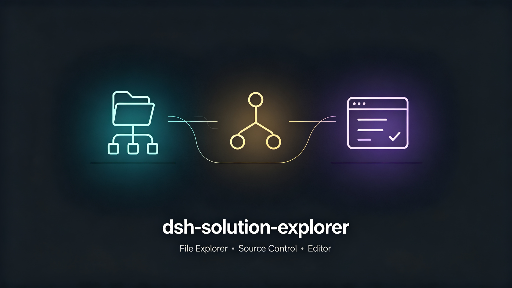
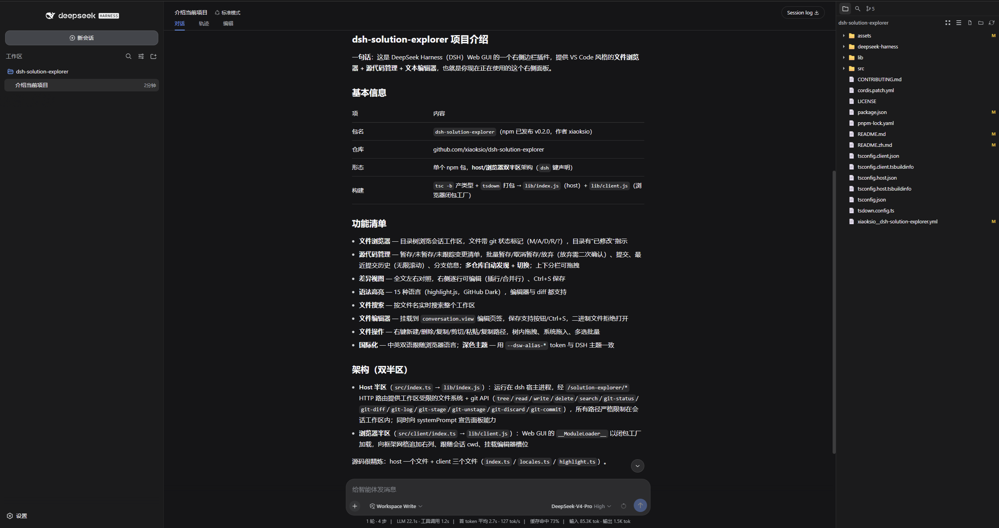
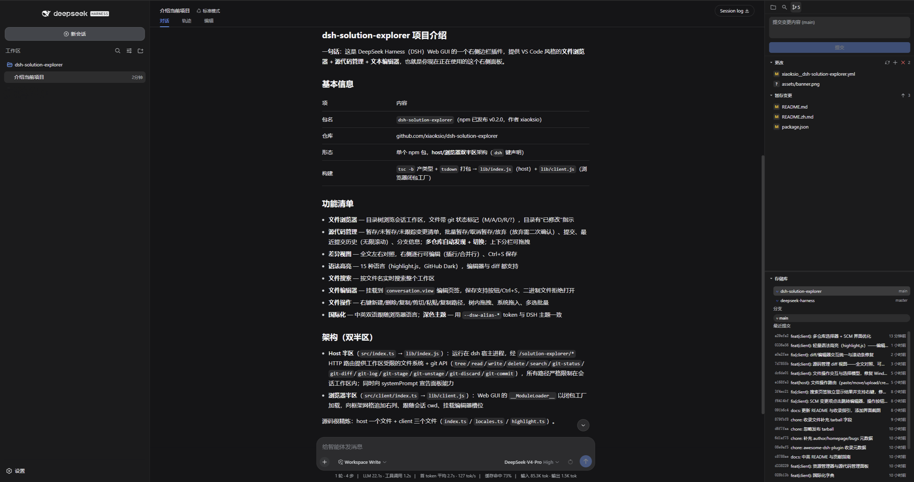
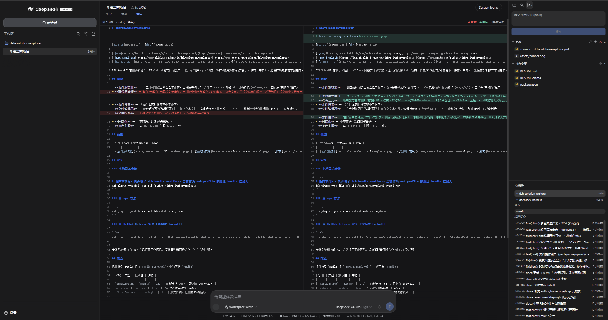

# dsh-solution-explorer



[English](README.md) | [中文](README.zh.md)

[](https://www.npmjs.com/package/dsh-solution-explorer)
[](https://www.npmjs.com/package/dsh-solution-explorer)
[](https://github.com/xiaoksio/dsh-solution-explorer)

Right-sidebar plugin for the DSH Web GUI: a VS Code-style file explorer plus
source control management (git status, stage/unstage/discard, commit, diff) and
a text editor with save, all in a dedicated right column of the three-column
layout.

## Features

- **File Explorer** — browse the current session workspace as a directory tree
  with expand/collapse, VS Code-style git status markers (M/A/D/R/?), and
  directory "modified" indicators.
- **Source Control** — staged / unstaged / untracked change lists with
  stage / unstage / discard (per-file or all), commit with a message, recent
  commit history (infinite scroll) and branch info. **Diff view**: full-file
  side-by-side compare with an editable right column (Enter splits lines,
  backspace/delete merges, NBSP placeholders), Ctrl+S to save. **Multi-repo
  support**: auto-discovers git repositories under the workspace and lets you
  switch between them; the SCM panel follows the selected repo. **Split panes**:
  drag the divider between changes and repository to resize, history fills the
  bottom. Bulk actions live in the section headers; discard all asks for
  confirmation.
- **Syntax highlighting** — editor and diff views colorize 15 languages
  (TS/JS/Python/JSON/Markdown/...) with a GitHub Dark theme; the editor
  re-highlights live while typing, lightweight.
- **File Search** — live name search across the workspace.
- **File Editor** — open any text file in an "Edit" tab of the conversation
  view, edit, and save (button or Ctrl+S); binary files are detected and
  refused instead of corrupted.
- **File operations** — context menu with new file/folder, delete (confirm
  dialog), copy / cut / paste, copy relative / absolute path; drag files within
  the tree, drag files in from the OS, multi-select bulk actions.
- **i18n** — English and Chinese, follows the browser language.
- **Dark theme** — matches the DSH Web UI tokens.

## Screenshots

| File Explorer | Source Control | Diff |
| --- | --- | --- |
|  |  |  |

## Installation

### From a local checkout

```sh
# Point dsh at this checkout; the package declares a dsh.bundle manifest so it
# is added as an active bundle layer of the web profile.
dsh plugin --profile web add /path/to/dsh-solution-explorer
```

### From npm

```sh
dsh plugin --profile web add dsh-solution-explorer
```

### From a GitHub Release (prebuilt tarball)

```sh
dsh plugin --profile web add https://github.com/xiaoksio/dsh-solution-explorer/releases/latest/download/dsh-solution-explorer-0.1.0.tgz
```

After installing, reload the Web UI. The explorer panel appears as its own right
column once a session with a workspace is active.

## Configuration

The plugin accepts an optional `config` in the bundle row
(`cordis.patch.yml`):

| Field | Type | Default | Description |
|-------|------|---------|-------------|
| `defaultWidth` | `number` | `280` | Panel width in px, clamped to 264–420. |
| `autoOpen` | `boolean` | `true` | Auto-open the panel when a session activates. |
| `filterPatterns` | `string[]` | `[]` | Name patterns to hide from the file tree. |

## Development

```sh
pnpm install
pnpm build    # tsc declarations + tsdown bundles (lib/index.js, lib/client.js)
pnpm watch    # rebuild on change
```

See [CONTRIBUTING.md](CONTRIBUTING.md) for the submission guide.

`pnpm install` also runs the `prepare` script, so a git-based install
(`dsh plugin add github:xiaoksio/dsh-solution-explorer`) builds `lib/` on
the target machine without manual steps.

## How it works

The plugin is a single npm package with two halves, both declared in
`package.json` under the `dsh` key:

- **Host half** (`src/index.ts`, exports `.` → `lib/index.js`): runs in the
  dsh host process and serves the workspace-gated filesystem and git API over
  HTTP routes under `/solution-explorer/*` (`tree`, `read`, `write`,
  `delete`, `search`, `git-repos`, `git-status`, `git-diff`, `git-log`,
  `git-stage`, `git-unstage`, `git-discard`, `git-commit`, `paste`, `move`,
  `upload`, `create`). All routes
  resolve paths strictly inside the session workspace root. It also announces
  itself in the system prompt so the agent knows what the panel can do.
- **Browser half** (`src/client/index.ts`, exports `./client` →
  `lib/client.js`): loaded by the Web GUI's `__ModuleLoader__` as a
  closure-factory bundle. It appends the explorer column to the frame grid
  (`[data-dsh-frame]`), follows the active session's `cwd`, and mounts the
  file editor into the `conversation.view` slot.

See [CONTRIBUTING.md](CONTRIBUTING.md) for development conventions and how to
submit the plugin to [awesome-dsh-plugin](https://github.com/awesome-dsh-plugin/awesome-dsh-plugin).

## License

MIT
