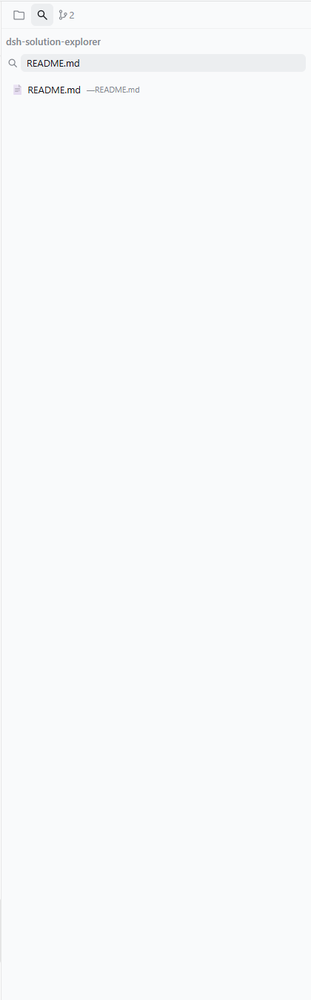

# dsh-solution-explorer

[English](README.md) | [中文](README.zh.md)

[](https://www.npmjs.com/package/dsh-solution-explorer)
[](https://www.npmjs.com/package/dsh-solution-explorer)
[](https://github.com/xiaoksio/dsh-solution-explorer)

DSH Web GUI 右侧边栏插件：VS Code 风格文件浏览器 + 源代码管理（git 状态、暂存/取消暂存/放弃变更、提交、差异）+ 带保存功能的文本编辑器，全部位于三列布局右侧的独立列中。

## 功能

- **文件浏览器** — 以目录树浏览当前会话工作区，支持展开/收起；文件带 VS Code 风格 git 状态标记（M/A/D/R/?），目录有"已修改"指示。
- **源代码管理** — 暂存/未暂存/未跟踪变更清单，支持逐个或全部暂存、取消暂存、放弃变更，带提交信息的提交、差异与最近提交历史、分支与领先/落后信息。批量操作（全部暂存/全部取消暂存/放弃所有）位于分区头，放弃所有需二次确认。
- **文件搜索** — 按文件名实时搜索整个工作区。
- **文件编辑器** — 在会话视图的"编辑"页签打开任意文本文件，编辑后保存（按钮或 Ctrl+S）；二进制文件会被识别并拒绝打开，避免损坏。
- **文件操作** — 右键菜单支持删除（确认对话框）与复制相对/绝对路径。
- **国际化** — 中英双语，跟随浏览器语言。
- **深色主题** — 与 DSH Web UI 主题 token 一致。

## 截图

| 文件浏览器 | 源代码管理 | 搜索 |
| --- | --- | --- |
|  |  |  |

## 安装

### 本地目录安装

```sh
# 指向本仓库；包声明了 dsh.bundle manifest，会被作为 web profile 的激活 bundle 层加入
dsh plugin --profile web add /path/to/dsh-solution-explorer
```

### 从 npm 安装

```sh
dsh plugin --profile web add dsh-solution-explorer
```

### 从 GitHub Release 安装（预构建 tarball）

```sh
dsh plugin --profile web add https://github.com/xiaoksio/dsh-solution-explorer/releases/latest/download/dsh-solution-explorer-0.1.0.tgz
```

安装后刷新 Web UI。会话打开工作区后，资源管理器面板会作为独立右列出现。

## 配置

插件接受 bundle 行（`cordis.patch.yml`）中的可选 `config`：

| 字段 | 类型 | 默认值 | 说明 |
|------|------|--------|------|
| `defaultWidth` | `number` | `280` | 面板宽度（px），限制在 264–420。 |
| `autoOpen` | `boolean` | `true` | 会话激活时自动打开面板。 |
| `filterPatterns` | `string[]` | `[]` | 从文件树中隐藏的名称模式。 |

## 开发

```sh
pnpm install
pnpm build    # tsc 产类型 + tsdown 打包（lib/index.js、lib/client.js）
pnpm watch    # 改动自动重建
```

收录提交指引见 [CONTRIBUTING.md](CONTRIBUTING.md)。

`pnpm install` 也会执行 `prepare` 脚本，因此基于 git 的安装（`dsh plugin add github:xiaoksio/dsh-solution-explorer`）会在目标机器上自动构建 `lib/`，无需手动步骤。

## 工作原理

插件是单个 npm 包，两个半区都声明在 `package.json` 的 `dsh` 键下：

- **Host 半区**（`src/index.ts`，导出 `.` → `lib/index.js`）：运行在 dsh 宿主进程中，通过 `/solution-explorer/*` 下的 HTTP 路由提供工作区受限的文件系统与 git API（`tree`、`read`、`write`、`delete`、`search`、`git-status`、`git-diff`、`git-log`、`git-stage`、`git-unstage`、`git-discard`、`git-commit`）。所有路由都把路径严格限制在会话工作区根目录内。它还会在系统提示词中宣告自身，让 agent 知道面板能做什么。
- **浏览器半区**（`src/client/index.ts`，导出 `./client` → `lib/client.js`）：由 Web GUI 的 `__ModuleLoader__` 以闭包工厂 bundle 形式加载。它向框架网格追加资源管理器列（`[data-dsh-frame]`），跟随当前会话的 `cwd`，并把文件编辑器挂载到 `conversation.view` 槽位。

开发约定与向 [awesome-dsh-plugin](https://github.com/awesome-dsh-plugin/awesome-dsh-plugin) 提交收录的指引见 [CONTRIBUTING.md](CONTRIBUTING.md)。

## 许可证

MIT
